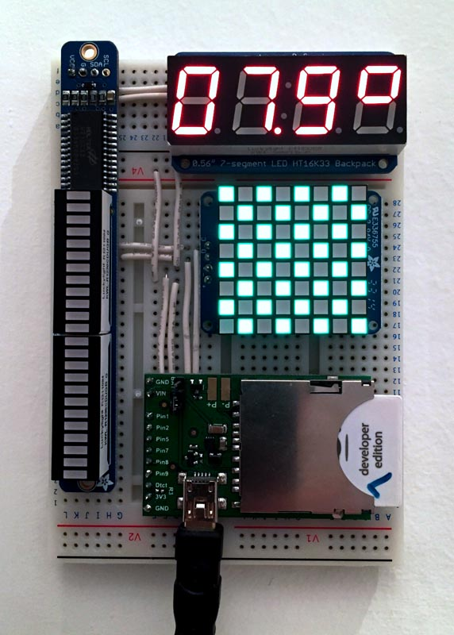
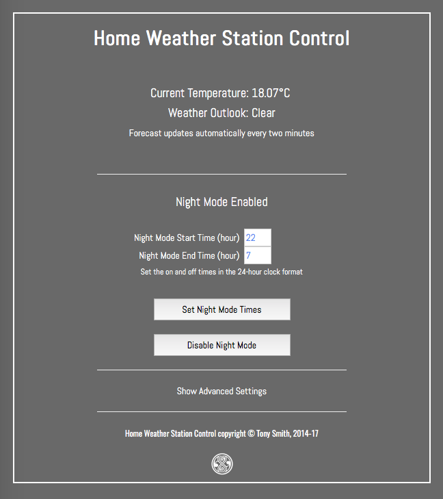

# HomeWeather 2.3

This software powers a home weather station based on the Electric Imp Platform.

## The Hardware

The station comprises an imp001 and April breakout board, plus an [Adafruit 0.56in seven-segment LED](https://www.adafruit.com/products/878), an [Adafruit 1.2in LED matrix display](https://www.adafruit.com/products/1856) and an [Adafruit bicolor LED bar](https://www.adafruit.com/products/1721). The display units connect to the imp001/April via I&sup2;C &mdash; it’s just a matter of wiring them all up to a single pair of imp I&sup2;C pins plus GND and 3V3. A larger solderless breadboard should accomodate them all.

## Dark Sky

The station uses [Dark Sky](https://darksky.net/)’s Dark Sky API for regular weather forecasts. This requires a developer account, which is free &mdash; register [here](https://darksky.net/dev/register). The Dark Sky API is a commercial service. Though the first 1000 API calls made each day under your API key are free of charge, subsequent calls are billed at a rate of $0.0001 per call. You and your application will not be notified by the [Electric Imp Dark Sky library](https://electricimp.com/docs/libraries/webservices/darksky/) if this occurs, so you may wish to add suitable call-counting code to your application.

### Dark Sky Units

The code is set to deliver Dark Sky forecast in UK units. You may wish to change this according to your location. Look for line 161 in the agent code.

## Squinter

The code makes use of the accompanying library, HT16K33Bargraph, in the file `ht16k33bargraph.class.nut`. If you are using the macOS tool Squinter (download [here](https://electricimp.com/docs/attachments/squinter/squinter_1_0_119.zip)) to manage your Electric Imp projects, the device code is set up (line 8) to import and pre-process this file. Alternatively, you can simply paste in the file contents over line 8.

## Control

The Weather Station has its own, web-based control UI, accessed at the agent URL.

## Release Notes

### 2.3

- Remove Build API integration
- Reworked web UI
- Add device boot message

### 2.2

- Initial re-release

## Licence

The Weather Station design and software is copyright &copy; 2014-17 Tony Smith and made available under the [MIT Licence](./LICENSE).
