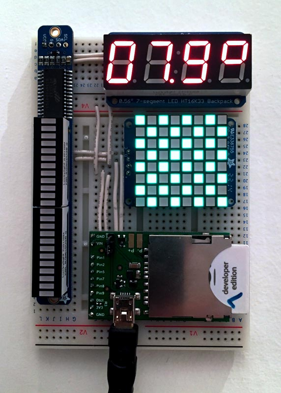
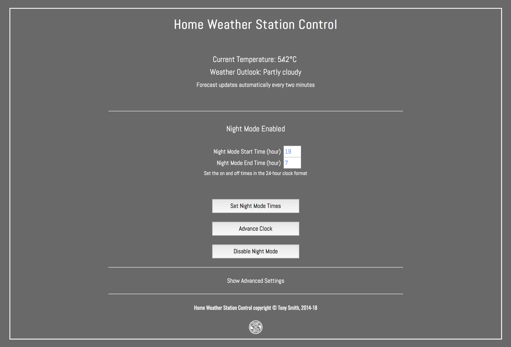

# HomeWeather 2.6 #

This software powers a home weather station based on the Electric Imp Platform.

## The Hardware ##

The station comprises an imp001 and April breakout board, plus an [Adafruit 0.56in seven-segment LED](https://www.adafruit.com/products/878), an [Adafruit 1.2in LED matrix display](https://www.adafruit.com/products/1856) and an [Adafruit bicolor LED bar](https://www.adafruit.com/products/1721). The display units connect to the imp001/April via I&sup2;C &mdash; it’s just a matter of wiring them all up to a single pair of imp I&sup2;C pins plus GND and 3V3. A larger solderless breadboard should accomodate them all.

## Dark Sky ##

The station uses [Dark Sky](https://darksky.net/)’s Dark Sky API for regular weather forecasts. This requires a developer account, which is free &mdash; register [here](https://darksky.net/dev/register). The Dark Sky API is a commercial service. Though the first 1000 API calls made each day under your API key are free of charge, subsequent calls are billed at a rate of $0.0001 per call. You and your application will not be notified by the [Electric Imp Dark Sky library](https://developer.electricimp.com/libraries/webservices/darksky) if this occurs, so you may wish to add suitable call-counting code to your application.

### Dark Sky Units ###

The code is set to deliver Dark Sky forecast in UK units. You may wish to change this according to your location. Look for line 161 in the agent code.

## Location ##

You will also need my [Location library](https://github.com/smittytone/Location) &mdash; paste it over line 7 in *both* the agent and device code. The Location library requires [Google-provided API keys](https://developers.google.com/maps/documentation/geolocation/intro), which you’ll need to enter into the agent code in the space provided on line 462, which will also need un-commenting.

## Display Libraries ##

The device code makes use of the accompanying libraries, HT16K33Bargraph, HT16K33Segment and HT16K33Matrix. The code for these libraries is available from the following GitHub repositories:

- [HT16K33Bargraph](https://github.com/smittytone/HT16K33Bargraph)
- [HT16K33Segment](https://github.com/smittytone/HT16K33Segment)
- [HT16K33Matrix](https://github.com/smittytone/HT16K33Matrix)

If you are using the macOS tool Squinter (download [here](https://smittytone.github.io/squinter/version2/index.html)) to manage your Electric Imp projects, the the device code is set up to import and pre-process these files. You may need to change the `#import` statements to reflect the location of the libraries on your machine. Alternatively, you can simply paste in the contents of each file over the respective `#import` statement.

## Control ##

The Weather Station has its own, web-based control UI, accessed at the agent URL.

## Release Notes ##

### 2.6 ###

**In Developement**

- Add automatic location detection (with [Location](https://github.com/smittytone/Location))
- Add ‘Advance Clock’ function to the night mode dimmer
- Improve disconnection handling with [DisconnectionManager](https://github.com/smittytone/generic/blob/master/disconnect.nut)

### 2.5 ###

- Assorted tweaks and generally bringing everything up to date

### 2.4 ###

- Add light rain icon
- Improve UI
- Remove UI version number
- Use generic boot message code

### 2.3 ###

- Remove Build API integration
- Reworked web UI
- Add device boot message

### 2.2 ###

- Initial re-release

## Licence ##

The Weather Station design and software is copyright &copy; 2014-18 Tony Smith and made available under the [MIT Licence](./LICENSE).
