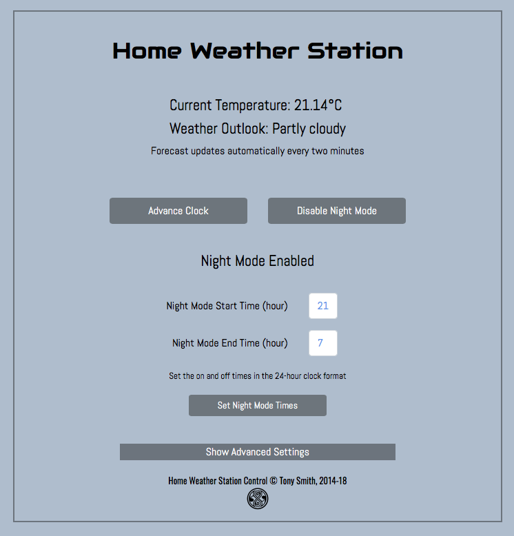

# HomeWeather 2.7.8 #

This software powers a home weather station based on the Electric Imp Platform.

## The Hardware ##

The station comprises an imp001 and April breakout board, plus an [Adafruit 0.56in seven-segment LED](https://www.adafruit.com/products/878), an [Adafruit 1.2in LED matrix display](https://www.adafruit.com/products/1856) and an [Adafruit bicolor LED bar](https://www.adafruit.com/products/1721). The display units connect to the imp001/April via I&sup2;C &mdash; it’s just a matter of wiring them all up to a single pair of imp I&sup2;C pins plus GND and 3V3. A larger solderless breadboard should accomodate them all.


## Cloning this Repository ##

This repo pulls in some dependencies through git submodules. Use this command to clone the repo and get the libraries on which it depends:

```
git clone --recurse-submodules https://github.com/smittytone/HomeWeather.git
```

## Weather Data ##

HomeWeather originally used [Dark Sky](https://darksky.net/) as its source of weather data. Version 2.7.8 uses [OpenWeather](https://openweathermap.org/), for which a local integration is included. DarkSky is expected to cease operation in 2022. OpenWeather, like DarkSky, requires you to set up a developer account for which you can obtain an API key. Please check the [OpenWeather website](https://openweathermap.org/) for API free-usage limits and pricing if you exceed those limits.

## Location ##

You will also need my [Location library](https://github.com/smittytone/Location) &mdash; paste it over line 7 in *both* the agent and device code. The Location library requires [Google-provided API keys](https://developers.google.com/maps/documentation/geolocation/intro), which you’ll need to enter into the agent code in the space provided on line 462, which will also need un-commenting.

## Display Libraries ##

The device code makes use of the accompanying libraries, HT16K33Bargraph, HT16K33Segment and HT16K33Matrix. The code for these libraries is available from the following GitHub repositories:

- [HT16K33Bargraph](https://github.com/smittytone/HT16K33Bargraph)
- [HT16K33Segment](https://github.com/smittytone/HT16K33Segment)
- [HT16K33Matrix](https://github.com/smittytone/HT16K33Matrix)

If you are using the macOS tool Squinter (download [here](https://smittytone.github.io/squinter/version2/index.html)) to manage your Electric Imp projects, the the device code is set up to import and pre-process these files. You may need to change the `#import` statements to reflect the location of the libraries on your machine. Alternatively, you can simply paste in the contents of each file over the respective `#import` statement.

## Control ##

The Weather Station has its own, web-based control UI, accessed at the agent URL.

<p align="center"></p>

## Release Notes ##

- 2.7.8 *Unreleased*
    - Switch weather data provider from DarkSky to [OpenWeather](https://openweathermap.org/).
- 2.7.7 *26 January 2021*
    - Implement GitHub-sourced dependencies as submodules.
    - Update Rocky to 3.0.1.
- 2.7.6 *2 December 2020*
    - Minor fixes and tweaks.
- 2.7.5 *21 May 2020*
    - Update JQuery to 3.5.x.
    - Update Bootstrap to 4.5.x.
- 2.7.4 *18 December 2019*
    - Fix incorrectly addressed UI button.
    - Update Rocky to 3.0.0.
- 2.7.3 *5 September 2019*
    - Update JQuery to 3.4.1
    - Update Bootstrap to 4.3.1
- 2.7.2 *18 April 2019*
    - Update JQuery to 3.4.0
- 2.7.1 *28 March 2019*
    - Update dependencies:
        - [DarkSky library](https://developer.electricimp.com/libraries/webservices/darksky)
        - [Location 1.5.3](https://github.com/smittytone/Location)
        - [Utilities 3.1.0](https://github.com/smittytone/generic)
- 2.7.0 *12 March 2019*
    - Update web UI code
    - Update dependencies:
        - [HT16K33Segment 2.0.0](https://github.com/smittytone/HT16K33Segment)
        - [HT16K33Bargraph 2.0.0](https://github.com/smittytone/HT16K33Bargraph)
        - [HT16K33Matrix 2.0.0](https://github.com/smittytone/HT16K33Matrix)
- 2.6.1 *1 November 2018*
    - Update to [Bootstrap 4.1.3](https://getbootstrap.com/)
    - Update other dependencies
- 2.6.0 *27 September 27 2018*
    - Update to [Bootstrap 4.1.1](https://getbootstrap.com/)
        - Update Web UI based on Bootstrap
        - Separate out Web UI into own file for clarity
    - Add automatic location detection (with [Location](https://github.com/smittytone/Location))
    - Add ‘Advance Clock’ function to the night mode dimmer
    - Improve disconnection handling with [DisconnectionManager](https://github.com/smittytone/generic/blob/master/disconnect.nut)
    - Update to [JQuery 3.3.1](https://jquery.com)
    - Prevent Ajax XHR caching
    - Stop DarkSky requests busting the limit

## Licence ##

The Weather Station design and software is copyright &copy; 2021 Tony Smith and made available under the [MIT Licence](./LICENSE).
